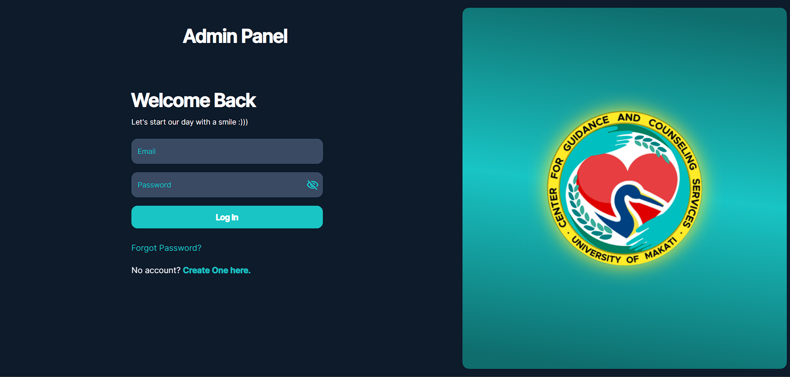
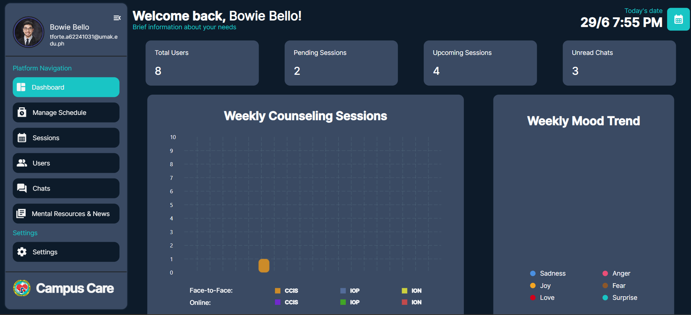
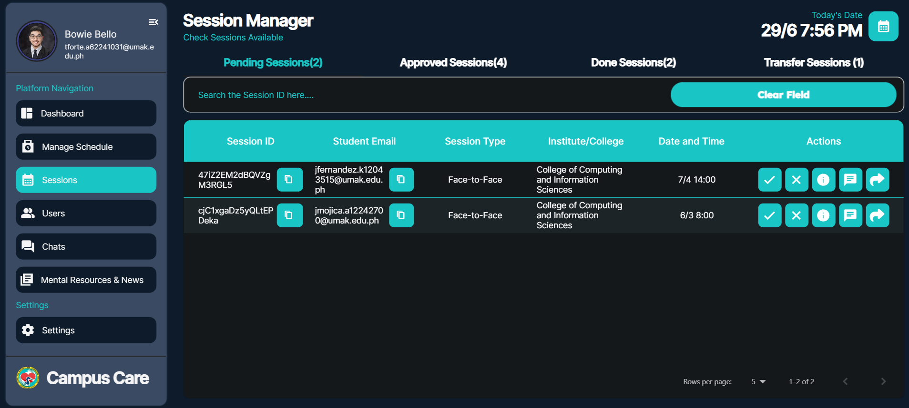
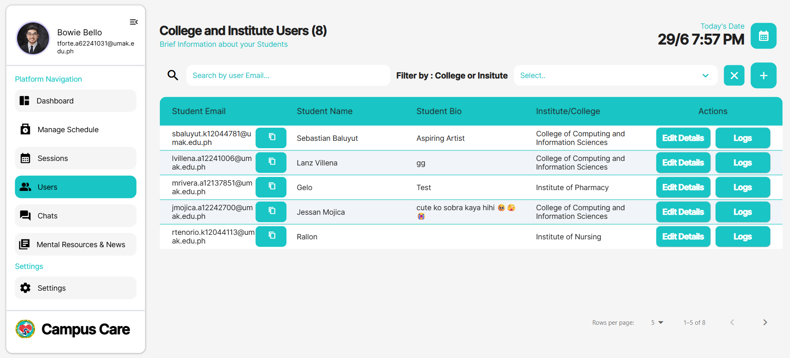
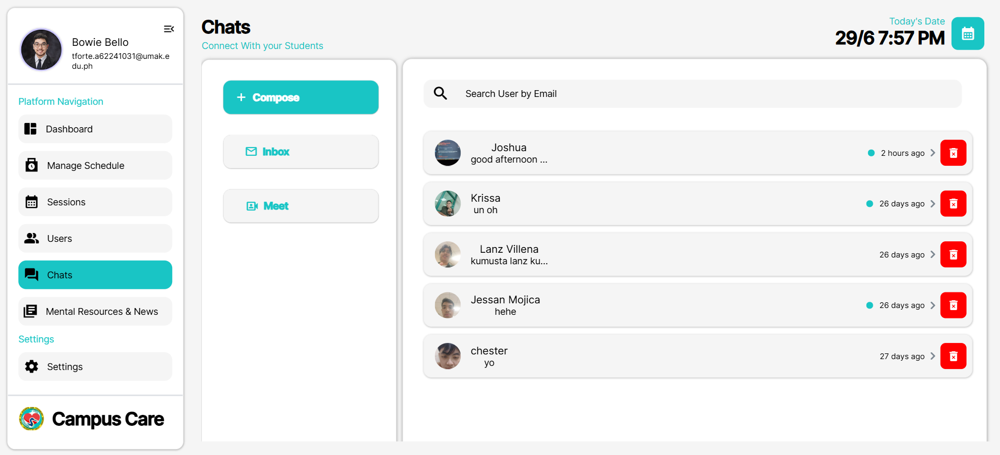

# CampusCareAdmin

> Empowering Student Well-being at University of Makati

CampusCareAdmin is a robust, AI-powered guidance counseling and admin platform for the University of Makati. Built with FlutterFlow, Flutter, and Firebase, it empowers admins and counselors to manage student well-being, appointments, and analytics in a secure, intuitive, and visually stunning environment.

---

## 🚀 Test the Website (Demo Account)

Want to explore CampusCareAdmin? Try logging in with our demo account:

- Email: tforte.a62241031@umak.edu.ph
- Password: G@giTryl4ng

Feel free to navigate, test features, and experience the app as a admin user!

---

## 🌟 Key Features

### Admin & Counselor Tools

- **Dynamic Dashboard**  
  Instantly view pending and approved counseling sessions, track appointments, and access real-time analytics—all in one place.
- **Session Management**  
  Approve, reschedule, or cancel student appointments with ease. Filter by department, session type (face-to-face or online), and status.
- **Counselor Management**  
  Create, update, or remove counselor profiles, schedules, and specializations.
- **Content Management**  
  Publish and update articles, events, and announcements to keep students informed and engaged.
- **Analytics & Reports**  
  Visual dashboards for mood trends, appointments, and engagement metrics, powered by interactive charts and tables.
- **Push Notifications**  
  Instantly notify students and counselors about session updates, reminders, and new resources.

### Student Experience (via integrated app)

- **Secure Authentication**  
  Sign in with your UMak email and enjoy a safe, private environment.
- **Mood Tracking & Visualization**  
  Log daily moods, reflect with interactive charts, and monitor your emotional journey.
- **AI-Powered Mood Summaries**  
  Receive instant, AI-generated insights and summaries of your mood logs.
- **Appointment Booking**  
  Browse counselor profiles, check real-time availability, and book/manage sessions.
- **Curated Self-Help Resources**  
  Access articles, videos, and exercises on stress, study skills, and personal growth.
- **Real-Time Messaging**  
  Chat securely with certified counselors for guidance and support.

---

## 🏗️ Project Structure

```
campus_care_admin_s_ide/
├── android/                # Android native files & configs
├── assets/                 # App assets (images, fonts, audios, etc.)
├── firebase/               # Firebase configs & custom cloud functions
│   ├── custom_cloud_functions/
│   └── functions/
├── ios/                    # iOS native files & configs
├── lib/                    # Main Flutter/Dart source code
│   ├── backend/            # Firestore, API, push notifications, etc.
│   ├── core/               # Main app modules (dashboard, resources, user, etc.)
│   ├── auth/               # Authentication logic
│   └── flutter_flow/       # FlutterFlow generated utilities
├── test/                   # Unit and widget tests
├── web/                    # Web support files
├── pubspec.yaml            # Dart/Flutter dependencies
└── README.md
```

---

## 🚀 Technology Stack

- **Frontend:** Flutter, FlutterFlow
- **Backend:** Firebase Auth, Firestore, Storage, Cloud Functions
- **AI/ML:** Python, HuggingFace Transformers, DistilBERT (for mood/emotion analysis)
- **Design/Prototyping:** Figma, FlutterFlow
- **CI/CD:** GitHub Actions, Firebase Hosting
- **Testing:** Manual usability testing

---

## 🤖 AI-Powered Mood Insights

CampusCareAdmin leverages artificial intelligence to enhance student well-being:

- **Automated Mood Analysis:**  
  Student mood logs are analyzed using a fine-tuned DistilBERT transformer, providing instant, intelligent feedback and summaries.
- **Emotion Detection:**  
  The AI can classify emotions such as sadness, joy, love, anger, fear, and surprise, helping counselors and students better understand emotional trends.
- **Custom Model Training:**  
  Our model was trained using HuggingFace Transformers and Google Colab, ensuring high accuracy and relevance for student mental health data.

---

## 🖼️ Screenshots

<p align="center">
  
  
  
  
  
</p>

---

## 🎨 Design & Prototypes

Check out our Figma designs and prototypes here:  
https://www.figma.com/design/uL8ySg520S6FQFeV7KKNOr/GUIDANCE-COUNSELING-APP?node-id=378-471

---

## 🛠️ Getting Started

### Prerequisites

- Flutter SDK ≥ 3.x
- FlutterFlow account
- Firebase project (Auth, Firestore, Storage enabled)
- IDE: Android Studio, VS Code, or IntelliJ IDEA

### Installation

1. **Clone the repo**
   ```bash
   git clone https://github.com/YourOrg/CampusCare.git
   cd campus_care_admin_s_ide
   ```
2. **Add Firebase config**
   - Copy `google-services.json` → `android/app/`
   - Copy `GoogleService-Info.plist` → `ios/Runner/`
3. **Install dependencies**
   ```bash
   flutter pub get
   ```

### Running the App

- **Android:**
  ```bash
  flutter run -d emulator-5554
  ```
- **iOS:**
  ```bash
  flutter run -d <your-ios-device>
  ```

---

## 💡 Usage

- Sign up / sign in with your UMak email.
- Complete your profile (department, bio, picture).
- Log your mood in the Mood Tracker daily.
- Browse the Discovery section for CGCS info, counselor profiles, and services.
- Book or cancel appointments and chat with counselors.
- Access self-help articles under the Resources tab anytime.

---

## 👥 Project Team

| Name            | Role                                |
| --------------- | ----------------------------------- |
| Ken Garcia      | Project Leader & Content Strategist |
| Mars Maguddayao | Researcher                          |
| Timothy Forte   | Frontend Designer & Developer       |
| Lanz Corpuz     | Backend Developer                   |
| Brian Ashley    | QA Tester & Documentation           |

---

## 📄 License

This project is licensed under the MIT License. See the LICENSE file for details.

---

> CampusCare: Designed with FlutterFlow. Engineered with Flutter & Dart. Enhanced by AI. Dedicated to student well-being.

---

> **Notice:**  
> Some features or integrations in this application may become deprecated or non-functional over time due to updates or changes in third-party services, APIs, or technology stacks (such as Flutter, Firebase, or AI libraries). Maintenance and updates may be limited if subscriptions or support for these services expire. For the latest compatibility, please refer to the official documentation of each technology used.
